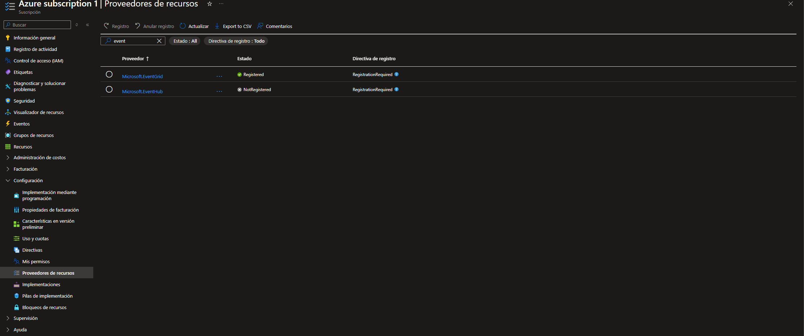
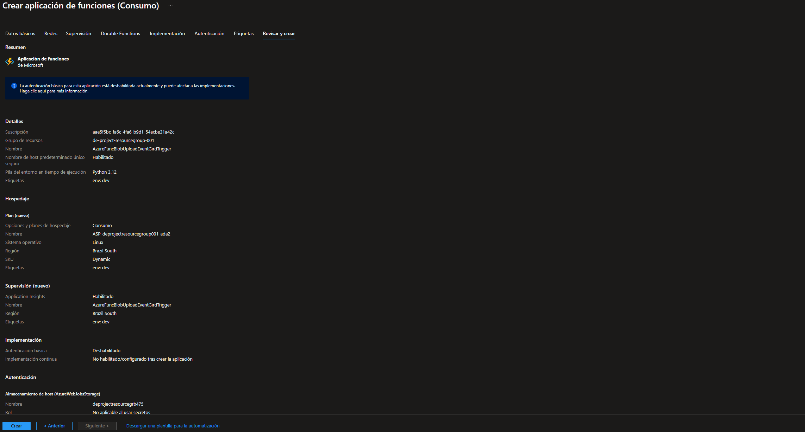
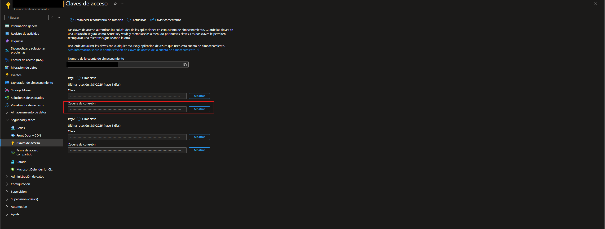
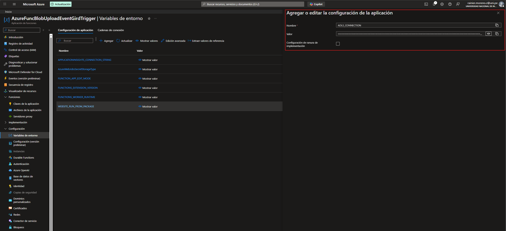
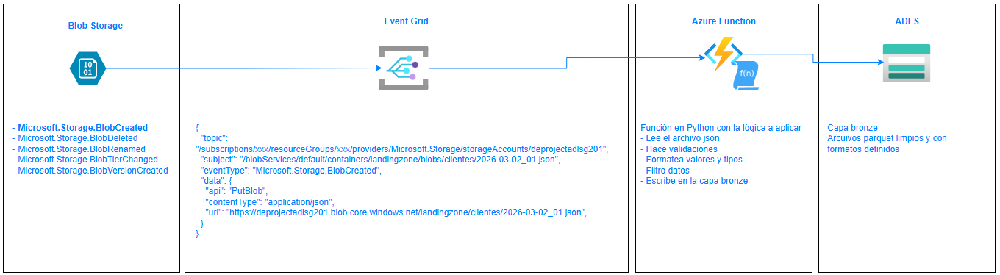

# ArquitecturaEvent-Driven_Azure

1- Estado Registrado para el proveedor de Event Grid en la suscripción

2- Creamos la función

3- En la cuenta de almacenamiento:  
    1. Claves de acceso  
    2. Key1  
    3. Cadena de conexión (copiar)  

4- En la cuenta de almacenamiento donde viven los datos (recomendado)   
    1. Control de acceso (IAM)  
    2. Agregar asignacion de rol  
    3. rol: Storage Blob Data Owner  
    4. Asignar a: Identidad administrada (elejimos la de nuestra funcion)  
    5. En variables de entorno de la funcion: ACCOUNT_URL: https://<nombre_cuenta_almacenamiento>.blob.core.windows.net  
4.0.1- Registramos la clave como variable (Produccion)  
    1. Function App  
    2. Configuración  
    3. Variables de entorno  
    4. [+]Agregar  

4.0.2- Registramos la clave como variable (Local - Desarrollo)  
    1. en local.settings.json  
    2. Agregamos NOMBRE_VARIABLE: cadena_de_conexion  
5- En la cuenta de almacenamiento donde van a existir los arhivos y versiones de la funcion  
    1. Control de acceso (IAM)  
    2. Agregar asignacion de rol  
    3. roles:   
        AzureWebJobsStorage__accountName: <nombre_cuenta_almacenamiento>, AzureWebJobsStorage__blobServiceUri: https://<nombre_cuenta_almacenamiento>.blob.core.windows.net,  
        AzureWebJobsStorage__queueServiceUri: https://<nombre_cuenta_almacenamiento>.queue.core.windows.net,AzureWebJobsStorage__tableServiceUri: https://<nombre_cuenta_almacenamiento>.table.core.windows.net  
6- Si trabajamos desde local en VSCode
    1. Desplegamos la funcion con: 
    ```bash
    func azure functionapp publish AzureFuncBlobUploadEventGirdTrigger --python --build remote
    ```
7- Configuramos el evento  
    1. Vamos a la cuenta de almacenamiento donde se van a cargar los archivos  
    2. Eventos  
    3. [+] Suscripcion a eventos  
    4. Damos nombre a la suscripcion y al tema  
    5. Seleccionamos el tipo de evento (trigger)  
    6. Configuramos la conexión (nuestra azure function)  
8- Probar subiendo un archivo tipo    
    [
  {
    "cliente_id": 1001,
    "nombre": "Juan Perez",
    "fecha_registro": "2024-03-10T10:00:00",
    "monto_compra": 150.50
  },
  {
    "cliente_id": 1002,
    "nombre": "Maria Garcia",
    "fecha_registro": "2024-03-11T12:30:00",
    "monto_compra": 2300.00
  },
  {
    "cliente_id": 1003,
    "nombre": "Carlos Lopez",
    "fecha_registro": "2024-03-12T09:15:00",
    "monto_compra": 45.75
  }
]

## Arquitectura
